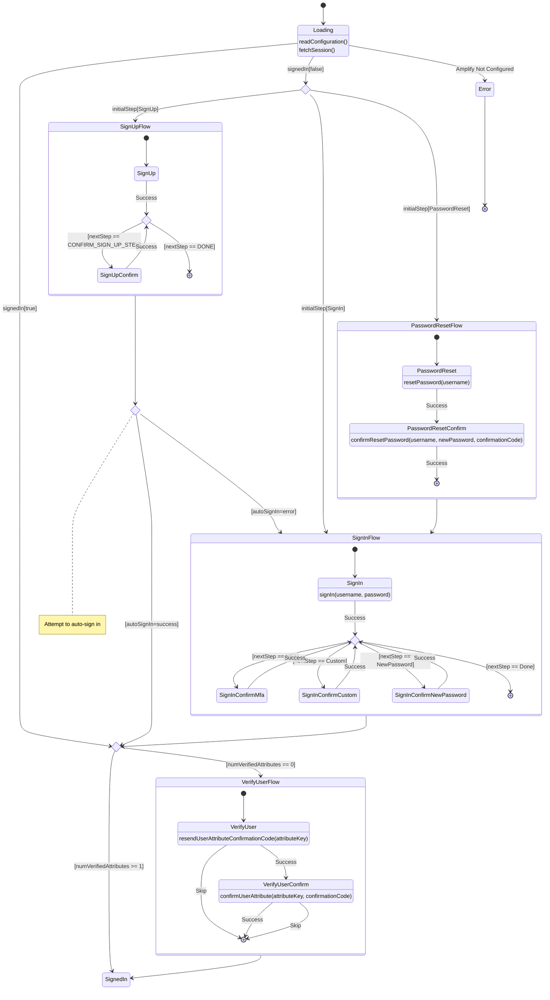

# Authenticator States

This document covers the state transitions for the Authenticator component as a [mermaid state diagram](https://mermaid.js.org/syntax/stateDiagram.html).

```mermaid
stateDiagram-v2
    state ChooseInitial <<choice>>
    state CheckAttributes <<choice>>
    state AutoSignIn <<choice>>

    [*] --> Loading

    Loading : Loading
    Loading : readConfiguration()
    Loading : fetchSession()
    Loading --> CheckAttributes : signedIn[true]
    Loading --> ChooseInitial : signedIn[false]
    Loading --> Error : Amplify Not Configured

    Error --> [*]

    ChooseInitial --> SignUpFlow : initialStep[SignUp]
    ChooseInitial --> SignInFlow : initialStep[SignIn]
    ChooseInitial --> PasswordResetFlow : initialStep[PasswordReset]

    state SignInFlow {
        state SignIn
        state SignInConfirmMfa
        state SignInConfirmNewPassword
        state SignInConfirmCustom
        state SignInNextStep <<choice>>

        [*] --> SignIn
        SignIn : SignIn
        SignIn : signIn(username, password)
        SignIn --> SignInNextStep : Success
        
        SignInNextStep --> SignInConfirmMfa : [nextStep == MFA]
        SignInNextStep --> SignInConfirmCustom : [nextStep == Custom]
        SignInNextStep --> SignInConfirmNewPassword : [nextStep == NewPassword]
        SignInNextStep --> [*] : [nextStep == Done]

        SignInConfirmMfa --> SignInNextStep : Success

        SignInConfirmNewPassword --> SignInNextStep : Success

        SignInConfirmCustom --> SignInNextStep : Success
    }

    state SignUpFlow {
        state SignUp
        state SignUpNextStep <<choice>>
        state SignUpConfirm

        [*] --> SignUp

        SignUp : SignUp
        SignUp --> SignUpNextStep : Success

        SignUpNextStep --> SignUpConfirm : [nextStep == CONFIRM_SIGN_UP_STEP]
        SignUpNextStep --> [*] : [nextStep == DONE]

        SignUpConfirm --> SignUpNextStep : Success
    }
    state PasswordResetFlow { 
        state PasswordReset
        state PasswordResetConfirm

        [*] --> PasswordReset

        PasswordReset : PasswordReset
        PasswordReset : resetPassword(username)
        PasswordReset --> PasswordResetConfirm : Success

        PasswordResetConfirm : PasswordResetConfirm
        PasswordResetConfirm : confirmResetPassword(username, newPassword, confirmationCode)
        PasswordResetConfirm --> [*] : Success
    }

    state VerifyUserFlow { 
        state VerifyUser
        state VerifyUserConfirm

        [*] --> VerifyUser

        VerifyUser : VerifyUser
        VerifyUser : resendUserAttributeConfirmationCode(attributeKey)
        VerifyUser --> VerifyUserConfirm : Success
        VerifyUser --> [*] : Skip

        VerifyUserConfirm : VerifyUserConfirm
        VerifyUserConfirm : confirmUserAttribute(attributeKey, confirmationCode)
        VerifyUserConfirm --> [*] : Success
        VerifyUserConfirm --> [*] : Skip
    }

    SignInFlow --> CheckAttributes
    PasswordResetFlow --> SignInFlow
    SignUpFlow --> AutoSignIn

    note right of AutoSignIn
        Attempt to auto-sign in
    end note
    AutoSignIn --> SignInFlow : [autoSignIn=error]
    AutoSignIn --> CheckAttributes : [autoSignIn=success]

    %%note right of CheckAttributes
    %%    Check if user has at least one verified 
    %%    attribute that could be used for account recovery
    %%end note
    CheckAttributes --> SignedIn : [numVerifiedAttributes >= 1]
    CheckAttributes --> VerifyUserFlow : [numVerifiedAttributes == 0]

    VerifyUserFlow --> SignedIn
   
```