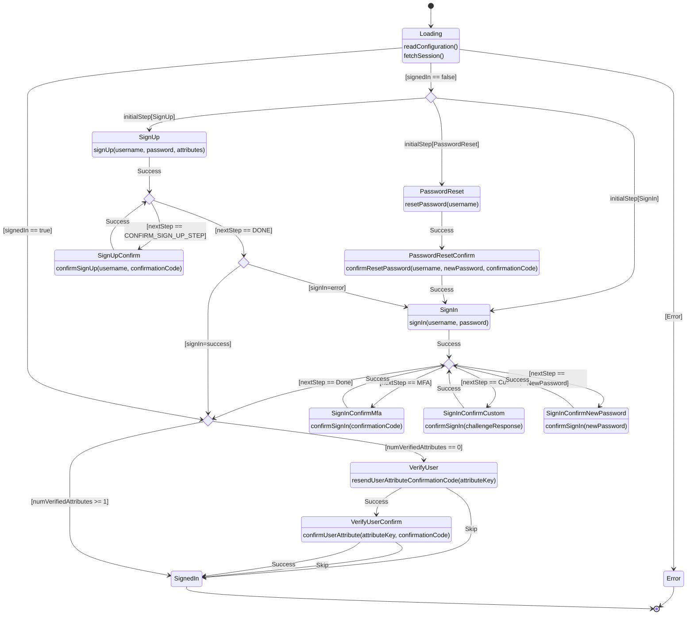

# Authenticator States

This document covers the state transitions for the Authenticator component as a [mermaid state diagram](https://mermaid.js.org/syntax/stateDiagram.html).

Some transitions are omitted for clarity:
- Most states (except `Loading`, `Error`, and `SignedIn`) can move to the initial states (`SignIn`, `SignUp`, `ResetPassword`) based on user action (e.g. clicking a "Back to Sign In" button).
- `SignIn` can have a next step that leads to `SignUpConfirm` (if SignUpConfirm was previously abandoned) or `ResetPassword` (if admin marks the account as needing password reset).

